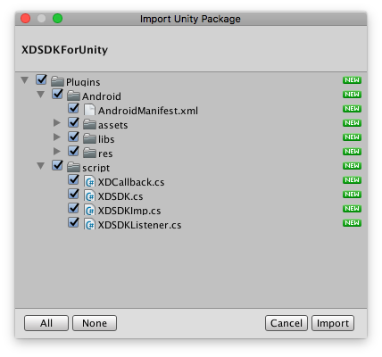

# <center> XDSDK-Unity3d </center>

## 1.Unity

<p style="color:red"> namespace均为xdsdk </p>

### 1.1.导入SDK资源

<p> 下载“XDSDK For Unity 3D”版本的SDK包。将其中的XDSDKForUnity.unitypackage文件导入到Unity工程里面（如果无法导入，请再次确认文件是放置于非中文路径下的），如下图所示： </p>
</img>

目录或文件 | 用途
--- |---
Plugins/script/XDSDK.cs | 心动SDK接口
Plugins/script/XDCallback.cs | 心动SDK回调
Plugins/script/XDSDKImp.cs | 心动SDK调用原生方法
Plugins/Android/libs | 心动SDK Android依赖库
Plugins/Android/res | 心动SDK Android资源文件

<p> 导入后，将Plugins/script下面的XDSDK.cs脚本文件拖动到任意对象中进行脚本挂接。 </p>


### 1.2.实现并设置回调方法

<p> 脚本需要实现的回调请参考以下代码： </p>

```
public class XDSDKHandler : XDCallback {

	public override void OnInitSucceed (){

	}

	public override void OnInitFailed (string msg){

	}

	public override void OnLoginSucceed (string token){

	}

	public override void OnLoginFailed (string msg){

	}

	public override void OnLoginCanceled (){

	}

	public override void OnGuestBindSucceed (string token){

	}

	public override void OnLogoutSucceed (){

	}

	public override void OnPayCompleted (){

	}

	public override void OnPayFailed (string msg){

	}

	public override void OnPayCanceled (){

	}

	public override void OnExitConfirm (){

	}

	public override void OnExitCancel (){

	}

}
```

<p>设置回调方法 </p>

```
XDSDK.SetCallback (new XDSDKHandler ());
```

### 1.3.配置登录选项

<p>心动SDK提供配置QQ、微信登录、游客登录的显示与隐藏以及登录方式。</p>

<p>如不进行配置，SDK将默认显示QQ、微信、游客登录。QQ和微信的登录方式默认为App授权登录，心动SDK会根据QQ和微信的安装情况，将QQ和微信登录方式切换为Web登录，或者不提供对应的登录功能。</p>

<p style="color:red">请勿直接复制以下代码，根据游戏实际需求选择调用以下API</p>

```
XDSDK.HideGuest()	//隐藏游客登录
XDSDK.HideWX()		//隐藏微信登录
XDSDK.HideQQ()		//隐藏QQ登录
XDSDK.ShowVC()		//显示VeryCD登录（此接口供老游戏兼容，新游戏不建议调用）
XDSDK.SetQQWeb()	//设置QQ为Web登录方式
XDSDK.SetWXWeb()	//设置微信为Web 扫码登录方式
```

### 1.4.初始化SDK

初始化心动SDK，调用该接口是调用其它功能接口的必要条件。

```
/**
 * @param appid 心动AppID
 * @param aOrientation 屏幕方向，0表示横屏，1表示竖屏
 */
public static void InitSDK(string appid, int aOrientation)
```

<p>示例代码：</p>

```
XDSDK.InitSDK ("xxxxxx", 1);
```

<p>调用该接口会触发下列回调。</p>
<p style="color:red">其他接口请在获取到初始化成功回调之后进行调用。</p>

类别 | 回调方法
--- |---
初始化成功 | public void OnInitSucceed()
初始化失败 | public void OnInitFailed(string msg)


### 1.5.登录

调用该接口进行登录。

```
public static void Login(){
```

示例代码
```
XDSDK.Login();
```

<p>调用该接口会触发下列回调。</p>
<p style="color:red">获取、查看用户信息以及支付接口请在获取到登录成功回调之后调用。</p>

类别 | 回调方法
--- | ---
登录成功 | void OnLoginSucceed(string token)
登录失败 | void OnLoginFailed(string msg)
登录取消 | void OnLoginCanceled()

### 1.6.获取Access Token

调用该接口获取当前登录用户的access token。

```
public static string GetAccessToken()
```

代码示例
```
XDSDK.GetAccessToken()
```

### 1.7.获取当前登录状态

```
public static bool IsLoggedIn()
```
代码示例
```
XDSDK.IsLoggedIn()
```

### 1.8.打开用户中心

调用该接口打开用户中心界面，用户可以在该界面进行登出和登录操作，游戏注意正确处理回调。在未登录状态，无法打开用户中心。在用户中心中，用户可进行登出操作，此时交互界面将消失。游戏需要提供引导用户重新进行登录的操作界面。

```
/**
* @return false表示尚未登录，重复调用默认为成功
*/
public static bool OpenUserCenter()
```
代码示例
```
XDSDK.OpenUserCenter()
```

### 1.9.发起支付

调用该接口发起支付。
<p style='color:red'>不保证在任何情况下都能收到回调，请勿直接使用SDK返回的支付结果作为最终判定订单状态的依据。</p>

```
/**
* @param info 支付相关信息，注意key和value都是字符串类型
*/
public static bool Pay(Dictionary<string, string> info)
```
其中info的字段如下。

参数 | 必须 |说明
--- | --- |--- 
Product_Name | 是 |商品名称，建议以游戏名称开头，方便财务对账
Product_Id | 是 | 商品ID
Product_Price | 是 | 商品价格（单位分）
Sid | 是 |所在服务器ID，不能有特殊字符，服务端支付回调会包含该字段
Role_Id | 否 | 支付角色ID，服务端支付回调会包含该字段
OrderId | 否 | 游戏侧订单号，服务端支付回调会包含该字段
EXT | 否 |额外信息，最长512个字符，服务端支付回调会包含该字段。

调用该接口会触发下列回调。

类别 | 回调方法
--- | ---
支付完成 | public void OnPayCompleted()
支付失败 | public void OnPayFailed(string msg) 
支付取消 | public void OnPayCanceled()

示例代码

```
Dictionary<string, string> info = new Dictionary<string,string>();
info.Add("OrderId", "1234567890123456789012345678901234567890");
info.Add("Product_Price", "1");
info.Add("EXT", "abcd|efgh|1234|5678");
info.Add("Sid", "2");
info.Add("Role_Id", "3");
info.Add("Product_Id", "4");
info.Add("Product_Name", "648大礼包");
XDSDK.Pay (info);
```

### 1.10.登出

需要注销当前登录用户时调用，该操作不会出现登录界面。

```
public static void Logout() 
```
调用该接口会触发下列回调

类别 | 回调方法
--- | ---
登出成功 | public void OnLogoutSucceed() 

示例代码
```
XDSDK.Logout();
```

### 1.11.游客升级

当游客账号升级成功时,会触发下列回调。<br/>
后续如需使用token，务必使用回调给的新token。但已生效的会话无需处理。

类别 | 回调方法
--- | ---
游客升级成功 | public void OnGuestBindSucceed(string token)

### 1.12.退出

调用该方法时，弹出确认框供用户选择是否退出。

```
public static void Exit()
```

示例代码

```
XDSDK.Exit();
```

调用该接口会触发下列回调
类别 | 回调方法
--- | ---
确认退出 | public void OnExitConfirm() 
取消退出 | public void OnExitCancel() 


## 2.Android

### 2.1.1.按需要修改AndroidManifest

<p> 根据需要修改Plugins/Android/AndroidManifest.xml中的主Activity屏幕方向
</p>

### 2.1.3.生成APK

<p>在Unity中生成APK，或将工程导出至Android Studio进行打包。

</img>

### 2.1.3.接入微信分享

<p>心动SDK目前仅提供微信登录功能，如果游戏需要使用微信分享功能，需要自行接入微信分享功能。需要注意下面几点。</p>

<p style="color:red">需要将工程导出至Android Studio进行操作</p>

<p style="color:red">微信分享的微信AppID必须使用心动提供的微信AppID，否则会导致微信登录失败</p>

<p>接入其它SDK提供的微信分享功能时，会被要求在项目中增加一个类“{游戏包名}.wxapi.WXEntryActivity”，这个类可能是复制SDK提供的一个类，或者继承SDK的一个类。无论如何，将其修改为另一个名字，比如“{游戏包名}.wxapi.MYWXEntryActivity”。</p>
<p>修改AndroidManifest中，Activity的配置内容</p>

```
<!-- 微信登录，仅在游戏不接入其它微信分享SDK时使用该方法 -->
<activity-alias
    android:name=".wxapi.WXEntryActivity"
    android:exported="true"
    android:targetActivity="com.xd.sdklib.helper.WXEntryActivity"/>

<!-- 微信登录和分享，游戏接入了其它微信分享SDK时必须使用该方法，并按照文章后面的内容进行处理
<activity
    android:name=".wxapi.WXEntryActivity"
    android:label="@string/app_name"
    android:exported="true"/>
-->
```

<p>在游戏项目中增加“{游戏包名}.wxapi.WXEntryActivity”类，内容如下，注意替换代码中花括号括起来的需要游戏自定的内容。</p>

```
package {游戏的包名(AndroidManifest.xml中的package)}.wxapi;

import android.app.Activity;
import android.content.Intent;
import android.os.Bundle;
import android.util.Log;

import com.tencent.mm.sdk.modelbase.BaseReq;
import com.tencent.mm.sdk.modelbase.BaseResp;
import com.tencent.mm.sdk.modelmsg.SendAuth;
import com.tencent.mm.sdk.modelmsg.SendMessageToWX;
import com.tencent.mm.sdk.openapi.IWXAPI;
import com.tencent.mm.sdk.openapi.IWXAPIEventHandler;
import com.tencent.mm.sdk.openapi.WXAPIFactory;
import com.xd.xdsdk.XDCore;

public class WXEntryActivity extends Activity implements IWXAPIEventHandler {

    private IWXAPI api;

    @Override
    protected void onCreate(Bundle savedInstanceState) {
        super.onCreate(savedInstanceState);
        this.api = WXAPIFactory.createWXAPI(this, XDCore.getInstance().getWXAppId(),false);
        this.api.handleIntent(getIntent(), this);
    }
    
    @Override
    protected void onNewIntent(Intent intent) {
        super.onNewIntent(intent);
        
        setIntent(intent);
        api.handleIntent(intent, this);
    }
    
    @Override
    public void onReq(BaseReq arg0) {
    }

    @Override
    public void onResp(BaseResp arg0) {
        if (arg0 instanceof SendMessageToWX.Resp) {
            Intent intent = new Intent();
            String str = getPackageName() + ".wxapi.{被改名的分享类名}" // 替换后的例子"wxapi.MYWXEntryActivity"
            intent.setClassName(getPackageName(), str);
            if (intent.resolveActivity(getPackageManager()) != null) {
                intent.putExtras(getIntent());
                startActivity(intent);
            }
            finish();
            return;
        }

        if (arg0 instanceof SendAuth.Resp) {
            switch (arg0.errCode) {
            case BaseResp.ErrCode.ERR_OK:
                String code = ((SendAuth.Resp)arg0).code;
                Log.d("微信code",code);
                //调用平台登录
                XDCore.getInstance().wxLogin(code);
                break;
            case BaseResp.ErrCode.ERR_USER_CANCEL:
                Log.d("微信登录","ERR_USER_CANCEL");
                break;
            case BaseResp.ErrCode.ERR_AUTH_DENIED:
                Log.d("微信登录","ERR_AUTH_DENIED");
                break;
            default:
                break;
            }
        }
        finish();
    }
}
```

## 3.iOS
